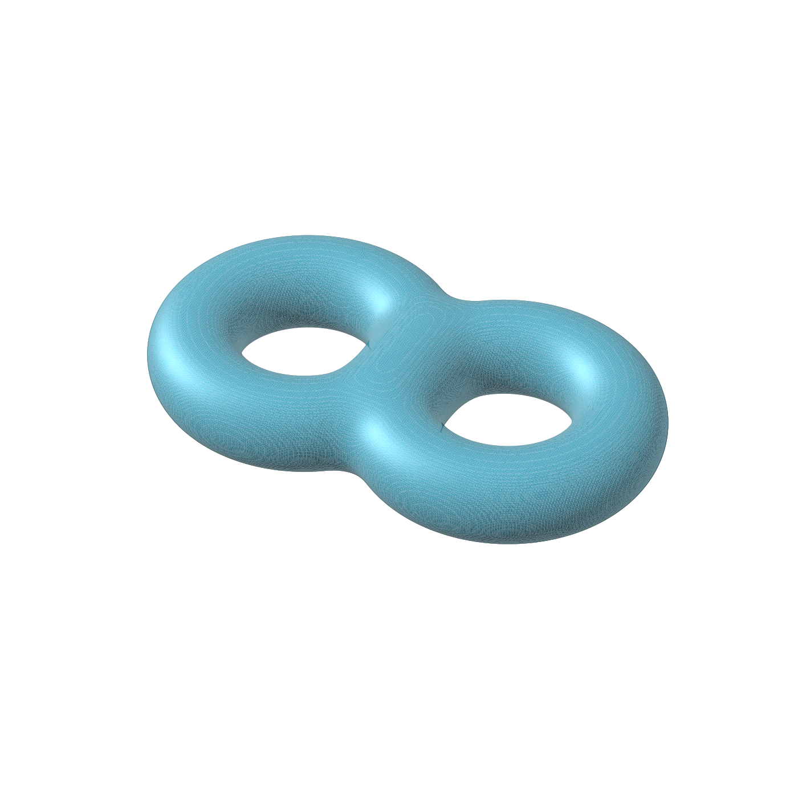
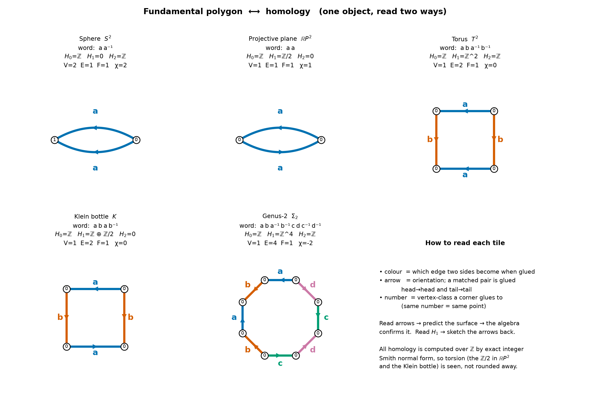
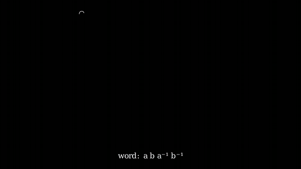
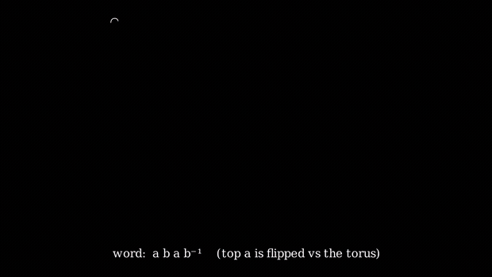

# Topology teaching toolkit

A small, fully **open-source** set of scripts for teaching undergraduate
topology — built around one idea: keep the *picture* and the *algebra* as two
readings of the **same object**, so visual intuition and formal computation
reinforce each other instead of competing.

Everything here runs on free software (NumPy, scikit-image, Matplotlib, and
[Manim Community](https://www.manim.community/)). No Mathematica required.

---

## 1. A genus-2 surface (two-holed torus)



`src/genus2.py` builds a genuine **genus-2 manifold** — two ring-tubes fused
by a smooth-minimum union into a *single connected surface with two holes*
(the connected sum of two tori), not two separate doughnuts. The isosurface is
extracted with marching cubes and shaded with back-face culling + two-light
Lambert shading for a clean matte look.

```bash
python src/genus2.py        # -> images/two_holed_torus.png
```

## 2. Fundamental polygon ⟷ homology



`src/surface_homology.py` turns an **edge word** (`a b a⁻¹ b⁻¹`, …) into its
cell complex — glue corners → 0-cells, letters → 1-cells, polygon → the 2-cell
— and reads homology straight off the **integer Smith normal form**. The
coloured, arrowed polygon *is* the input to the computation, so image and
algebra are the same datum:

- exact arithmetic over ℤ, so torsion is **seen, not rounded away**
  (the ℤ/2 in ℝP² and the Klein bottle);
- torus vs. Klein bottle differ by exactly one flipped arrow — and that flip is
  precisely the ℤ/2 the algebra reports.

It is meant to be poked: add a line to `SURFACES` (say `aabb`, or an 8-gon) and
it recomputes cells, χ, homology, and the π₁ presentation. Good for
*predict-then-check* exercises.

```bash
python src/surface_homology.py   # prints the table + writes images/surface_homology.png
```

Output (abridged):

```
Torus  T^2        word = a b a⁻¹ b⁻¹    χ = 0
    H0 = ℤ    H1 = ℤ^2      H2 = ℤ
Klein bottle K    word = a b a b⁻¹      χ = 0
    H0 = ℤ    H1 = ℤ ⊕ ℤ/2  H2 = 0
```

## 3. Gluing a square into a torus (Manim)



`src/manim_torus.py` animates the fundamental polygon folding up:
**square → cylinder → torus**. The two identified edges survive as the two
generating loops of H₁(T²) = ℤ²:

- `a` (blue) → **meridian** (around the tube)
- `b` (orange) → **longitude** (around the hole)

so the animation closes the image⇄algebra loop in motion. Full-quality video:
[`media/TorusGluing.mp4`](media/TorusGluing.mp4).

```bash
manim -qm src/manim_torus.py TorusGluing
```

## 4. Gluing a square into a Klein bottle (Manim)



`src/manim_klein.py` runs the *same* construction with the word `a b a b⁻¹` —
the two `a`-edges are glued with a **flip** (antiparallel). Step 1 (glue the
sides `b` → cylinder) is identical to the torus; Step 2 glues the ends with a
reversal, which forces the tube to **pass through itself** (drawn as the
figure-8 immersion in ℝ³). That one flip is the whole difference:

|       | word          | H₁        | orientable? |
|-------|---------------|-----------|-------------|
| Torus | `a b a⁻¹ b⁻¹` | ℤ²        | yes         |
| Klein | `a b a b⁻¹`   | ℤ ⊕ ℤ/2   | no          |

The flip makes `2a = 0` in homology — and that relation *is* the torsion ℤ/2
computed in part 2. Full quality: [`media/KleinGluing.mp4`](media/KleinGluing.mp4).

```bash
manim -qm src/manim_klein.py KleinGluing
```

---

## Setup

```bash
python -m venv .venv && source .venv/bin/activate
pip install -r requirements.txt
```

Manim additionally needs system libraries (Cairo, Pango) and **ffmpeg** — see
the [Manim install guide](https://docs.manim.community/en/stable/installation.html).

## Ideas for extending

- more surfaces in `SURFACES` (connected sums, non-orientable words);
- an octagon → genus-2 gluing animation (the surface from part 1);
- pair each surface with a formal proof leg in **Lean 4 + Mathlib**
  (`Mathlib/Topology/…`) — the natural "image → algebra → proof" progression.

## License

No license file yet — add the license of your choice before sharing publicly
(MIT is a common pick for teaching material).
